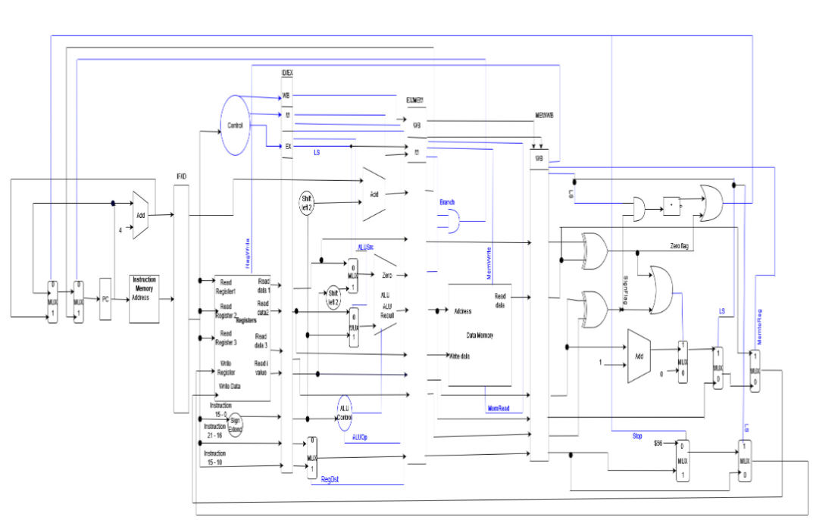

# MIPS-Design-for-Linear Search Array

## Assumptions:
- Store key value, base address and size in the registers.
- Write the output value to register.
- Time delays for individual components are as follows:
    - ALU and adders: 2ns
    - Register file, Instruction memory and memory unit: 2ns
    - Rest of the components: 0ns

## Instruction Set Architecture
### Introducing new Instruction type - `A type` Instruction:
####   `Linear Search`:

- LS $s0, $s1, $s2, $s3
- Rd= $s0, Rs=$s1, Rt=$s2, Rk=$s3
- Rd= Destination Register, Rs= key, Rt= Base address of Array, Rk = size
- $s0 - Destination Register
- $s1-key
- $s2-Base Adress of array
- $s3- size of array


| Opcode    | Rs | Rt    | Rd  | Rk    | Don't care | 
| -------- | ------- | -------- | ------- | -------- | ------- |
| 14  | 32    | 33    | 31    | 34    | x    |


| Instruction    | Example | Meaning  | 
| -------- | ------- | -------- |
| Linear Search  | ls $s0, $s1, $s2, $s3    | Search a key value linearly through array. Writes index value in register $s0 if found, 0 otherwise    | 

> Comments:

- #$s0 - Destination Register
- #$s1 - key
- #$s2 - Base Adress of array
- #$s3 - size of array

## Advantages
- Included new `A type` instruction for efficient linear search of an
array.
- There is good flexibility in this instruction set as further
types can be added when required.
- Existing mips instructions are supported since mips circuit has been
modified from the existing one.

## Disadvantages
- Lot of components have been used, it might be expensive in real
world.
- Hazards have not been handled.

## Assembly Program

```assembly code
ls $s0, $s1, $s2, $s3 #$s0- Destination Register
                      #$s1-key
                      #$s2-Base Adress of array
                      #$s3- size of array
Addi $iv, $0, $0      #Flushing the index register to 0
```

## Datapath



## Performance

Assume that time delays for individual components are as follows:
>ALU and adders: 2ns

>Register file and Instruction memory and memory unit :2ns

>Rest of the components: 0ns

- Cycle time = 2ns
- Instruction Count (IC) = 2
- No. of Cycles = n+1
- CPI = (n+1)/2
- Execution Time = CPI x IC x Cycle time = 2(n+1) ns